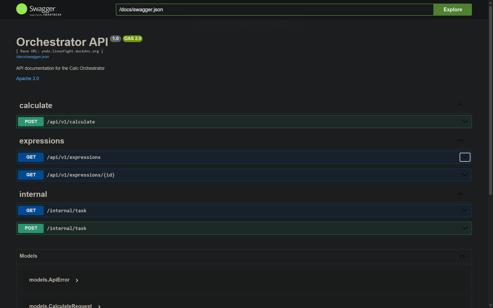
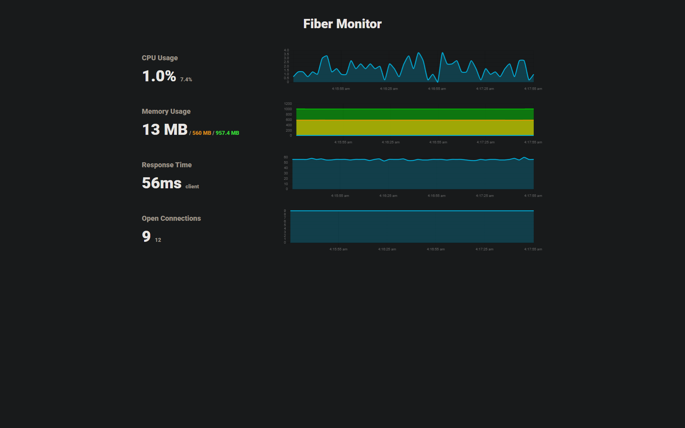

# Распределённый калькулятор

## Запуск
Чтобы запустить, вам понадобится [Docker](https://www.docker.com/products/docker-desktop/).
```shell
# уже собранные образы, быстрее, но вы явно захотите проверить, что всё собирается)
docker compose up

# собрать вручную, если вы хотите проверить localhost:9090
docker compose -f local-compose.yml up
```

## Задеплоенная версия
Доступно по адресу:
- https://yndx.linuxfight.duckdns.org

## Веб интерфейс

Веб интерфейс для отправки запросов к API (я бы мог сделать фронтэнд, но не успеваю)

Веб: https://yndx.linuxfight.duckdns.org/swagger

Локально: http://localhost:9090/swagger

## Статистика

Это интерфейс для просмотра статистики по запросам и метрик по ресурсам.

Веб: https://yndx.linuxfight.duckdns.org/stats

Локально: http://localhost:9090/stats

## Примеры запросов
### ```POST /api/v1/calculate``` - передать выражение на вычисление
```shell
curl -X 'POST' \
  'http://localhost:9090/api/v1/calculate' \
  -H 'accept: application/json' \
  -H 'Content-Type: application/json' \
  -d '{
  "expression": "2+2"
}'
```
201, создано новое выражение:
```json
{
  "id": "671fd919-3941-4e39-9872-325177cbf921"
}
```
200, выражение уже существует:
```json
{
  "id": "671fd919-3941-4e39-9872-325177cbf921"
}
```
422, неверный JSON или неверное выражение:
```json
{
  "message": "error message",
  "status": 422
}
```

### ```GET /api/v1/expressions``` - получить список всех выражений
```shell
curl -X 'GET' \
  'http://localhost:9090/api/v1/expressions' \
  -H 'accept: application/json'
```
200, список выражений:
```json
{
  "expressions": [
    {
      "id": "671fd919-3941-4e39-9872-325177cbf921",
      "result": 0,
      "status": "PROCESSING"
    },
    {
      "id": "931c29b8-d1dc-4170-b6e2-eab6c0982875",
      "result": 21934864,
      "status": "DONE"
    },
    {
      "id": "dda00c16-97dc-47f6-871f-ad333fb6efff",
      "result": 0,
      "status": "DONE"
    },
    {
      "id": "0c227d24-3dab-49cc-a027-30549b83990d",
      "result": 3,
      "status": "DONE"
    },
    {
      "id": "958b8a53-7bec-4022-84ef-638267e878da",
      "result": 4,
      "status": "DONE"
    },
    {
      "id": "d87db348-ddbf-496d-8ac4-24d67afeb09c",
      "result": 1.6488130238405602e+26,
      "status": "DONE"
    }
  ]
}
```

### ```GET /api/v1/expressions/{id}``` - получить выражение по ID
```shell
curl -X 'GET' \
  'http://localhost:9090/api/v1/expressions/928b303f-cfcc-46f4-ae24-aabb72bbb7d9' \
  -H 'accept: application/json'
```
200: результат
```json
{
  "id": "2de2c6dd-6d3d-481d-9925-7837eed9ac90",
  "arg1": 3,
  "arg2": 0,
  "operation": "/",
  "operation_time": 1000,
  "expression_id": ""
}
```
404: выражение не найдено
```json
{
  "message": "not found",
  "status": 404
}
```
422: неверный uuid
```json
{
  "message": "invalid uuid",
  "status": 422
}
```

## Как это работает?

1. Есть две части: оркестратор и агент.
2. Как только приходит запрос на создание выражения, то проверяется его наличие в кэше, если его нет, то он не создаётся, если он есть, то возвращается из кэша.
3. Оркестратор разбивает выражение на части и сохраняет в Redis.
4. Агент получает данные из оркестратора и решает выражения.
5. Как только выполнение закончено результат сохраняется в бд.
